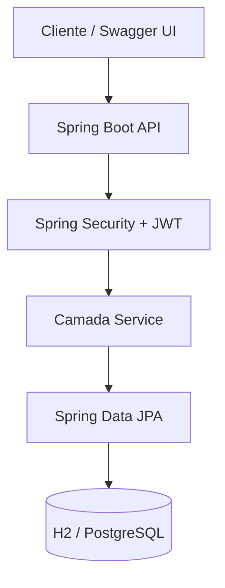
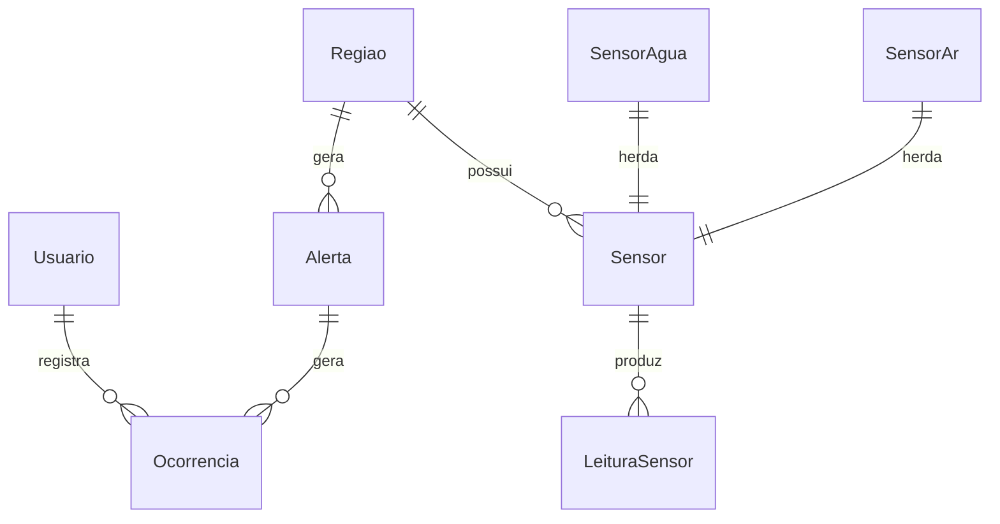

# OrbitalGuard API

API REST de monitoramento ambiental desenvolvida para a **FIAP Global Solution** (Java Advanced). O OrbitalGuard centraliza o gerenciamento de regioes monitoradas, sensores ambientais, leituras, alertas e ocorrencias.

## Links do Projeto

| Recurso | URL |
|---------|-----|
| Repositorio GitHub | https://github.com/GomesMancera/OrbitalGuard-java |
| Deploy (API) | https://orbitalguard-api.onrender.com |
| Swagger / OpenAPI | https://orbitalguard-api.onrender.com/swagger-ui/index.html |
| Health Check | https://orbitalguard-api.onrender.com/actuator/health |
| Video apresentacao (10 min) | _Substituir apos gravacao_ |
| Video pitch (3 min) | _Substituir apos gravacao_ |

## Integrantes

| Nome | RM |
|------|-----|
| Integrante 1 | RM000000 |
| Integrante 2 | RM000000 |

## Proposta da Solucao

O OrbitalGuard e uma plataforma de monitoramento ambiental que integra sensores de agua e ar distribuidos em diferentes regioes. A API permite:

- Cadastrar regioes geograficas com coordenadas GPS
- Gerenciar sensores especializados (agua/ar) com heranca JPA
- Registrar leituras com chave composta (sensor + data/hora)
- Emitir alertas por regiao e registrar ocorrencias vinculadas

## Tecnologias Utilizadas

- Java 17
- Spring Boot 3.3
- Spring Data JPA
- Spring Security + JWT
- Spring HATEOAS
- Spring Validation
- Lombok
- Spring Boot DevTools
- Springdoc OpenAPI (Swagger)
- H2 (desenvolvimento)
- PostgreSQL (producao)
- Maven
- Docker
- Render (deploy)

## Arquitetura



### Estrutura de Pacotes

```
br.com.fiap.orbitalguard
├── controller    # REST + HATEOAS
├── service       # Regras de negocio
├── repository    # JpaRepository
├── model         # Entidades JPA
├── dto           # Records (request/response)
├── exception     # Tratamento global de erros
├── config        # Security, CORS, OpenAPI
└── security      # JWT
```

## Modelo de Dados



### Modelagem Avancada JPA

| Recurso | Implementacao |
|---------|---------------|
| Heranca | `Sensor` -> `SensorAgua` / `SensorAr` (JOINED) |
| Chave composta | `LeituraSensorId` (sensorId + dataHoraLeitura) |
| Embedded | `Coordenadas` em `Regiao` e `Sensor` |
| Multiplas tabelas | 8+ tabelas relacionadas |

## Endpoints

### Autenticacao (publico)

| Metodo | Endpoint | Descricao |
|--------|----------|-----------|
| POST | `/api/v1/auth/register` | Registrar usuario |
| POST | `/api/v1/auth/login` | Login e obter JWT |

### Regioes

| Metodo | Endpoint | Auth |
|--------|----------|------|
| GET | `/api/v1/regioes` | Publico (listagem/detalhe) |
| GET | `/api/v1/regioes/{id}` | Publico |
| POST | `/api/v1/regioes` | JWT (ADMIN/OPERADOR) |
| PUT | `/api/v1/regioes/{id}` | JWT (ADMIN/OPERADOR) |
| DELETE | `/api/v1/regioes/{id}` | JWT (ADMIN) |

### Sensores, Leituras, Alertas, Ocorrencias, Usuarios

| Recurso | Base URL |
|---------|----------|
| Sensores | `/api/v1/sensores` |
| Leituras | `/api/v1/leituras` |
| Alertas | `/api/v1/alertas` |
| Ocorrencias | `/api/v1/ocorrencias` |
| Usuarios | `/api/v1/usuarios` |

Todos exigem JWT (exceto GET de regioes). Documentacao completa no Swagger.

## Como Executar Localmente

### Pre-requisitos

- Java 17+
- Maven 3.9+

### Passos

```bash
git clone https://github.com/GomesMancera/OrbitalGuard-java.git
cd OrbitalGuard-java
mvn spring-boot:run -Dspring-boot.run.profiles=dev
```

A API estara em `http://localhost:8080`

- Swagger: http://localhost:8080/swagger-ui/index.html
- H2 Console: http://localhost:8080/h2-console (JDBC: `jdbc:h2:mem:orbitalguard`)

## Exemplos de Teste (curl)

### 1. Registrar usuario

```bash
curl -X POST http://localhost:8080/api/v1/auth/register \
  -H "Content-Type: application/json" \
  -d "{\"nome\":\"Operador\",\"email\":\"operador@orbitalguard.com\",\"senha\":\"senha123\"}"
```

> Registro publico cria usuarios com role `OPERADOR`. Em dev, existe admin seed: `admin@orbitalguard.com` / `admin123`.

### 2. Login

```bash
curl -X POST http://localhost:8080/api/v1/auth/login \
  -H "Content-Type: application/json" \
  -d "{\"email\":\"admin@orbitalguard.com\",\"senha\":\"senha123\"}"
```

### 3. Criar regiao (com token)

```bash
curl -X POST http://localhost:8080/api/v1/regioes \
  -H "Content-Type: application/json" \
  -H "Authorization: Bearer SEU_TOKEN" \
  -d "{\"nome\":\"Amazonia\",\"descricao\":\"Regiao norte\",\"latitude\":-3.46,\"longitude\":-62.21}"
```

### 4. Criar sensor de agua

```bash
curl -X POST http://localhost:8080/api/v1/sensores \
  -H "Content-Type: application/json" \
  -H "Authorization: Bearer SEU_TOKEN" \
  -d "{\"nome\":\"Sensor Rio\",\"localizacao\":\"Marginal\",\"tipo\":\"AGUA\",\"regiaoId\":1,\"latitude\":-23.55,\"longitude\":-46.63,\"phMinimo\":6.5,\"phMaximo\":8.5,\"turbidezMaxima\":50}"
```

## Testes Automatizados

```bash
mvn test
```

Cobertura: autenticacao JWT, CRUD de regioes, sensores com heranca, validacao (400), not found (404).

## Deploy no Render

1. Fazer push do codigo para o GitHub
2. No Render, criar **PostgreSQL** (free)
3. Criar **Web Service** com Docker ou Maven:
   - Build: `mvn clean package -DskipTests`
   - Start: `java -jar target/orbitalguard-1.0.0.jar`
4. Configurar variaveis de ambiente:
   - `SPRING_PROFILES_ACTIVE=prod`
   - `JWT_SECRET` (string aleatoria com 32+ caracteres)
   - `DATABASE_URL` (fornecida pelo Render)
5. Usar o arquivo `render.yaml` para deploy automatico (Blueprint)

## Informacoes para Avaliacao

- API REST com verbos HTTP corretos e status codes padronizados
- HATEOAS em todas as respostas de recursos (links `self`, `update`, `delete` e relacionais)
- DTOs com Java Records e validacao Bean Validation (`@NotBlank`, `@Email`, `@Min`, `@DecimalMin`, etc.)
- Tratamento global de excecoes com respostas JSON padronizadas
- Spring Security com autenticacao JWT e autorizacao por roles (`ADMIN`, `OPERADOR`)
- Modelagem JPA avancada: heranca JOINED, chave composta, `@Embeddable`
- Documentacao Swagger com botao Authorize
- CORS configurado para acesso externo
- Profiles separados para dev (H2) e prod (PostgreSQL)
- Testes de integracao com JUnit 5 + MockMvc
- CI configurado em `.github/workflows/ci.yml`

## Checklist de Entrega (Global Solution)

| Item | Status |
|------|--------|
| Codigo da API completo | Concluido |
| `mvn test` local | Executar antes do deploy |
| Repositorio GitHub publico | https://github.com/GomesMancera/OrbitalGuard-java |
| Deploy Render | https://orbitalguard-api.onrender.com — ver [DEPLOY.md](DEPLOY.md) |
| Links no README | Atualizar apos deploy e videos |
| Video 10 min | Pendente |
| Pitch 3 min | Pendente |
| Entrega URL GitHub na plataforma FIAP | Pendente |

## Licenca

Projeto academico - FIAP Global Solution.
